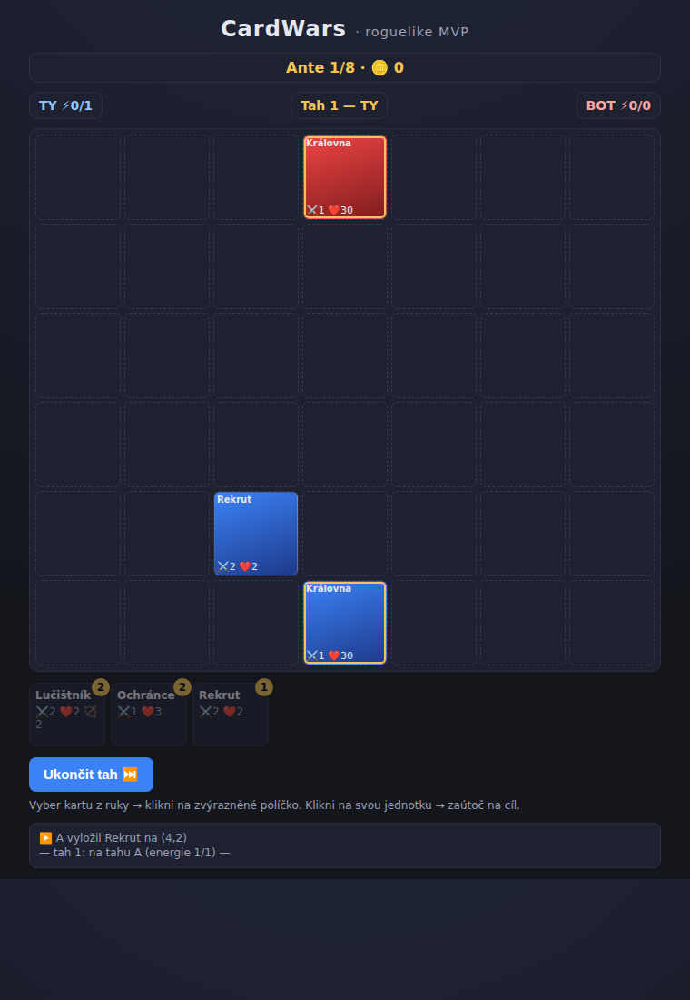
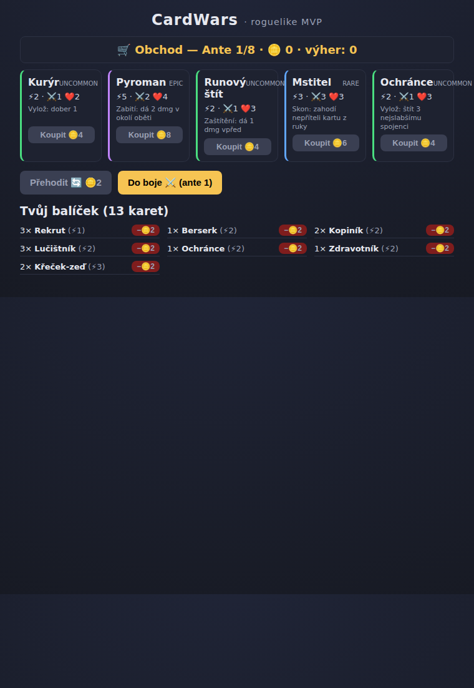

# CardWars

> Roguelike deckbuilder, kde se karty pokládají na mřížku a expanduje se z vlastní **Královny**. Cílem je zabít Královnu soupeře dřív, než on zabije tu tvoji.

CardWars kombinuje tři věci, které spolu obvykle nebývají:

1. **Territoriální pokládání** – novou kartu smíš položit jen na políčko sousedící s nějakou svojí už vyloženou kartou. Rosteš z Královny jako z hnízda a mezi armádami vzniká „fronta".
2. **Taktický souboj na mřížce** – karty mají život, sílu, dostřel a hlavně **směrové schopnosti** (zásah diagonálně vpřed, léčení souseda, minové pole kolem sebe…). Na pozici záleží.
3. **Roguelike ekonomika mezi koly** – po každém souboji nakupuješ a vylepšuješ karty, tvaruješ balíček a stoupáš obtížností proti stále silnějším botům.

Vítězná podmínka je jednoduchá jako v šachu: **padne Královna, končí hra.** Všechno ostatní je o tom, jak si k ní prokoušeš cestu — nebo jak tu svoji ubráníš.

---

## Stav projektu

**Hratelné roguelike MVP běží.** Kompletní smyčka: **obchod → souboj → obchod**, 8 ante proti sílícímu botovi, stavění balíčku za zlato. Deska 7×6, přiléhavé pokládání, energie, souboj, systém schopností. Vše v prohlížeči, buildí se do **jednoho HTML souboru** (~35 kB) pro itch.io.

Souboj a obchod:




Plán platforem: MVP na webu/itch → případná plná verze v **C#/Unity na Steam** → **multiplayer + ELO** do budoucna. Detaily v [`docs/09-technologie.md`](docs/09-technologie.md).

## Spuštění

```bash
npm install
npm run dev        # hraní v prohlížeči (vývojový server)
npm run build      # -> dist/index.html (jeden soubor pro itch.io)
npm run smoke      # headless: bot vs bot, 20 partií musí dojet do konce
npm run runsmoke   # headless: 40 celých runů musí skončit (won/lost)
```

## Kde co najdeš

| Dokument | O čem je |
|---|---|
| [`docs/01-vize.md`](docs/01-vize.md) | Vize, čím je hra unikátní, srovnání s existujícími hrami, jestli to má potenciál |
| [`docs/02-herni-design.md`](docs/02-herni-design.md) | Jádro hry: deska, tahy, energie, souboj, pravidlo přiléhavosti, výhra |
| [`docs/03-karty-a-klicova-slova.md`](docs/03-karty-a-klicova-slova.md) | Anatomie karty, systém klíčových slov (triggery / efekty / cíle), rarity |
| [`docs/04-seznam-karet.md`](docs/04-seznam-karet.md) | Datové schéma karty + ukázkový set karet napříč raritami |
| [`docs/05-meta-progrese.md`](docs/05-meta-progrese.md) | Ekonomika, obchod, vylepšování, struktura runu |
| [`docs/06-ai-protivnik.md`](docs/06-ai-protivnik.md) | Jak bude přemýšlet bot |
| [`docs/07-otevrene-otazky.md`](docs/07-otevrene-otazky.md) | Rozhodnutí, která je potřeba společně dořešit |
| [`docs/08-roadmapa.md`](docs/08-roadmapa.md) | MVP a milníky vývoje |
| [`docs/09-technologie.md`](docs/09-technologie.md) | Tech a platformy: web MVP (jeden HTML soubor, itch) → C#/Unity (Steam) → MP + ELO |
| [`docs/10-architektura.md`](docs/10-architektura.md) | Architektura kódu + kuchařka „jak přidat nový efekt / trigger / kartu" |

## Jak s dokumentací pracujeme

Tohle je živý zápisník návrhu. Co spolu vymyslíme, píšeme sem. Otevřené otázky se sbírají v [`docs/07-otevrene-otazky.md`](docs/07-otevrene-otazky.md) a jak je rozhodneme, přesouvají se do příslušného designového dokumentu jako hotové pravidlo.
